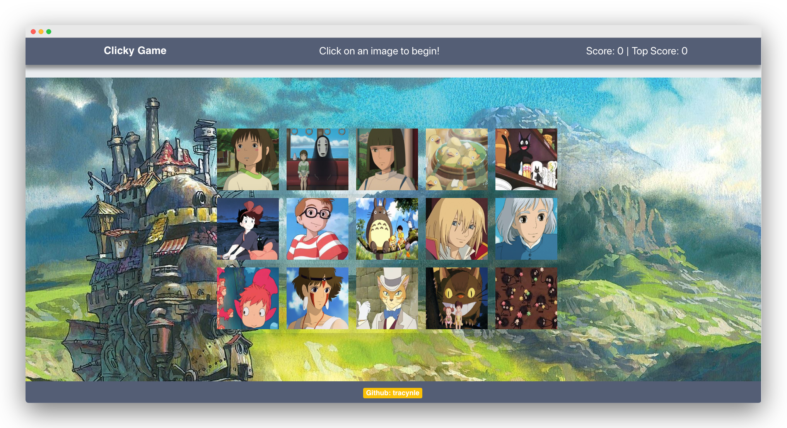

# Studio Ghibli Clicky Game

This memory game is made with React, a JavaScript library created by Facebook. This framework simplifies user interfaces and optimizes single-page or mobile applications.

## [Play the Game!](https://fathomless-plateau-65663.herokuapp.com/)

## How to Play

- Click on any image to earn points.  
- The images will shuffle after each click.
- Continue to click on other images to earn points but remember to not click on the same image, otherwise you will start over.
- Try to get all 15 images correctly! Good luck!

## Prerequesites
Node
git (Windows) or Terminal (Mac)

## Installation

1. Decide where you would like to clone the project. 
2. Run this command in the terminal:

`git clone git@github.com:tracynle/clicky-game.git`

3. Then: `cd clicky-game` 

4. Install the node dependenices:
`npm install`
    - The npm install may take a moment

5. To start the React app type:
`npm start` 
    - The game will load and you can begin playing!

## OR
You can go to the [Heroku App](https://fathomless-plateau-65663.herokuapp.com/)

# Built with
- React
- JSX
- JavaScript ES6
- Bootstrap
- HTML/CSS3
- Node dependencies
- Google Fonts
- Heroku 

